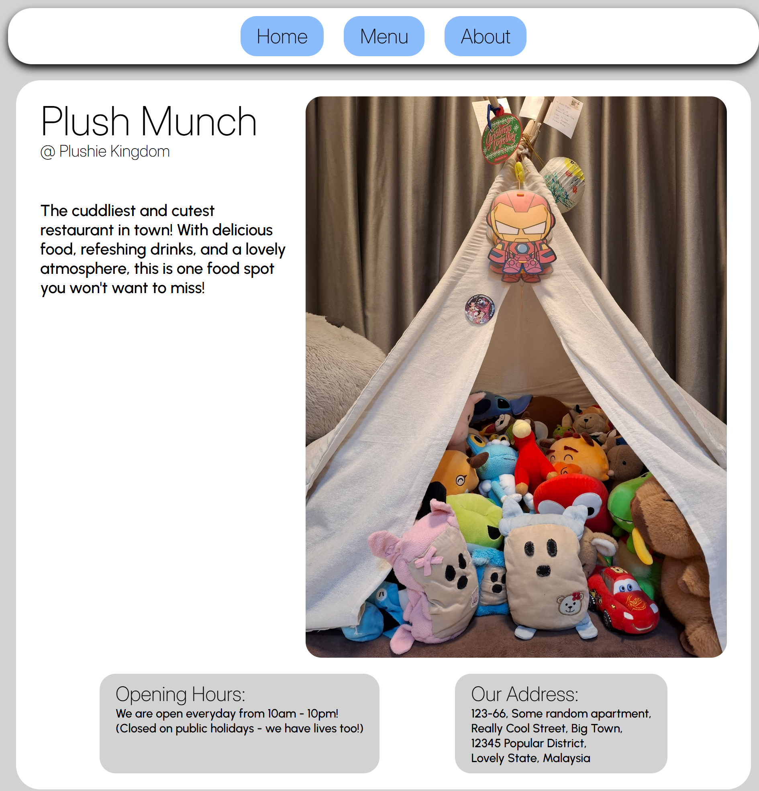
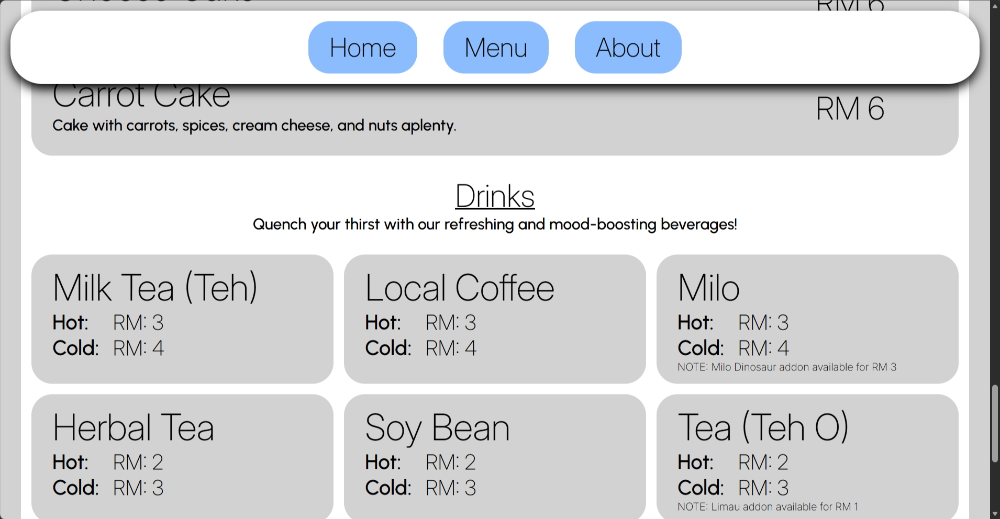
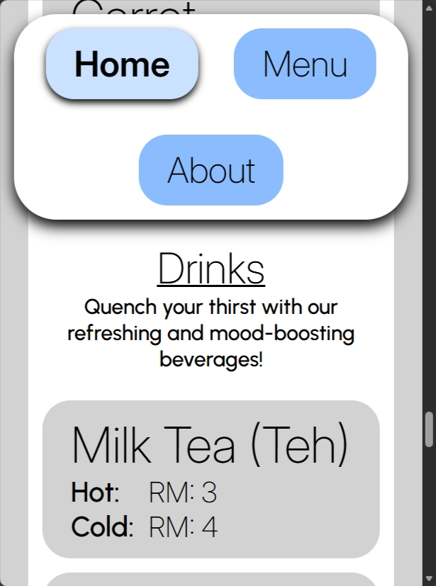
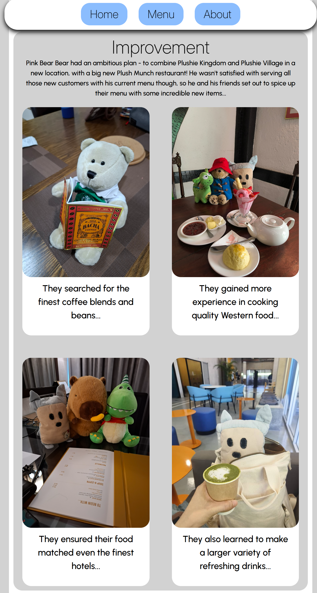
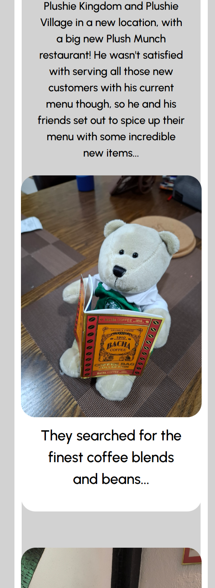

# restaurant-page
Restaurant page project based on The Odin Project curriculum.

Live demo link: https://j0e-quan.github.io/restaurant-page/

## Technologies used:
 - HTML for forming basic page layout
 - CSS for styling elements and use of web fonts (Inter for headings, Urbanist for body text)
 - Flexbox and Grid for organising elements
 - JavaScript for dynamically creating page elements
 - npm and webpack for managing code modules
 - Git for version control

## Key features:
 - Page layout is dynamically generated using JavaScript (except for header)
 - Web fonts and pictures make page look more attractive and improve readability
 - Layout of certain page elements e.g. drinks list automatically adjust according to viewport width

## Credits:
 - All pictures were taken by me

## Gallery:

## Getting started:
1. clone this repo in your desired folder: `git clone git@github.com:J0e-Quan/restaurant-page.git`
2. `npm install` to install any required dependencies
3. `npm run dev` to activate the dev server (View the project by navigating to the localhost address shown in your terminal.)
4. `npm run build` will bundle the code into the 'dist' folder 